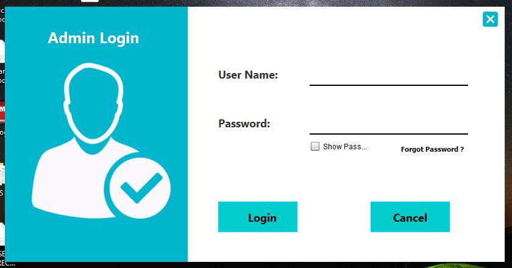
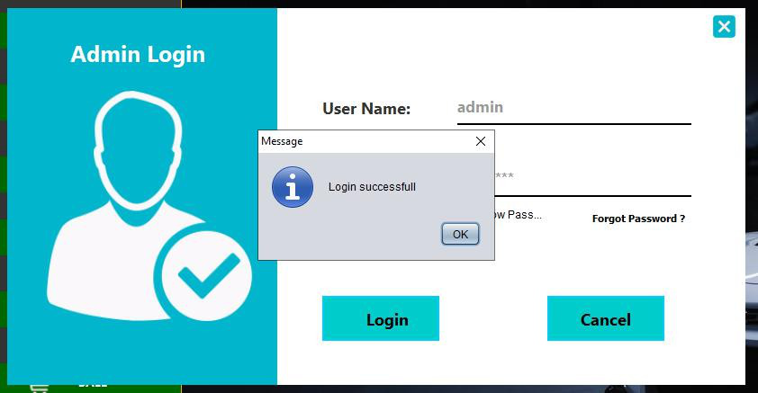
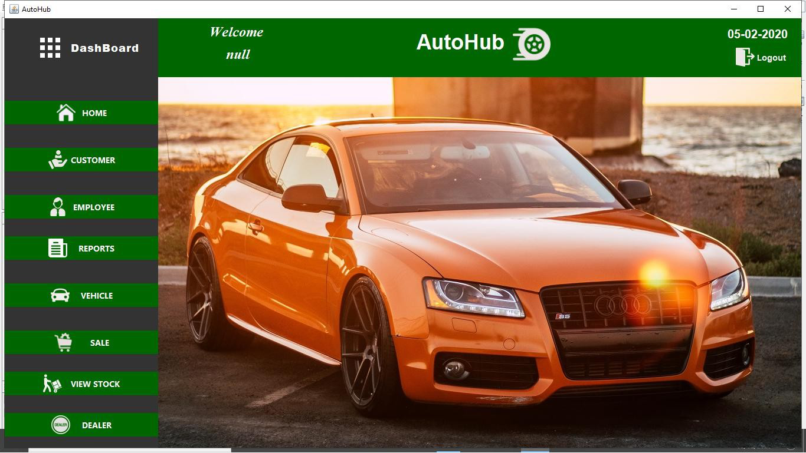
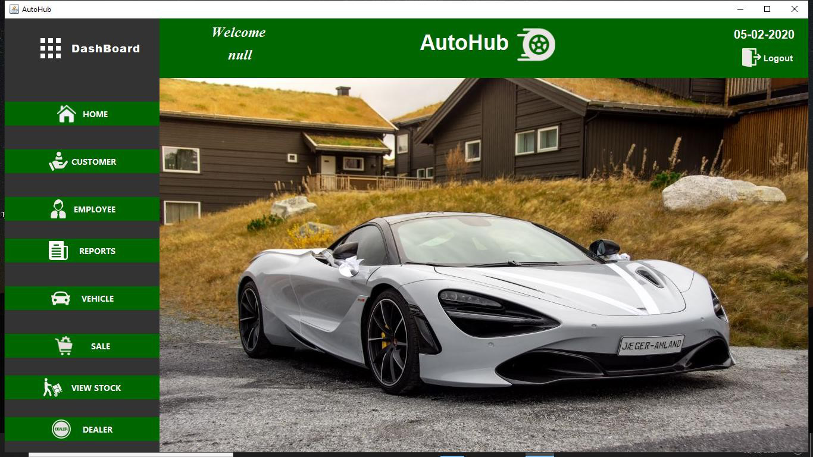
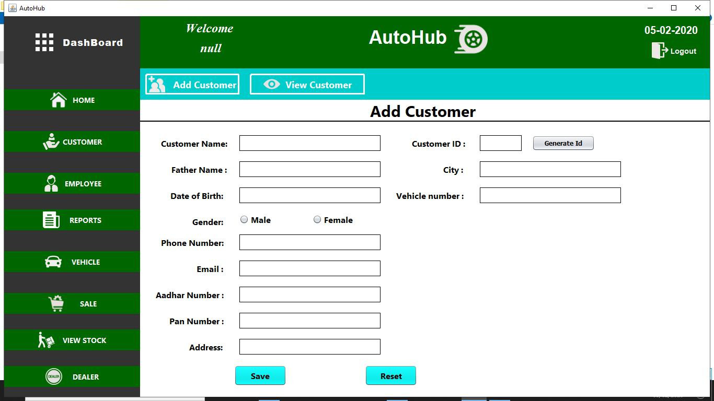
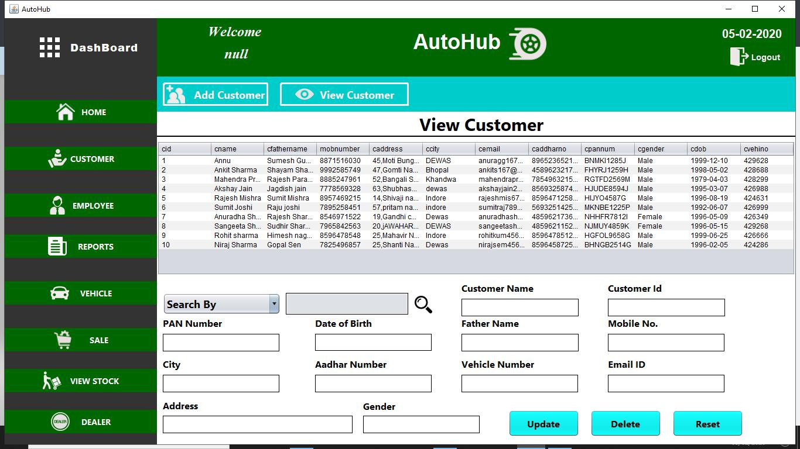
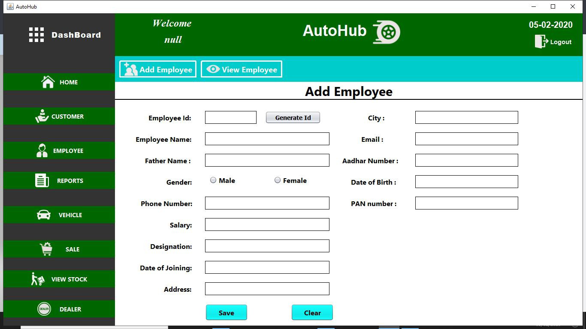
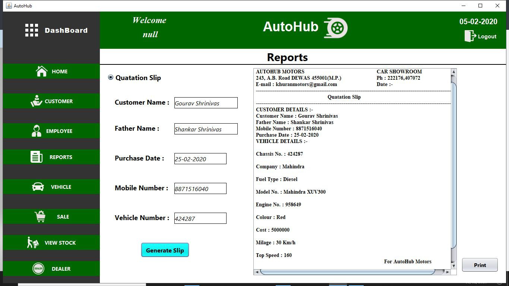
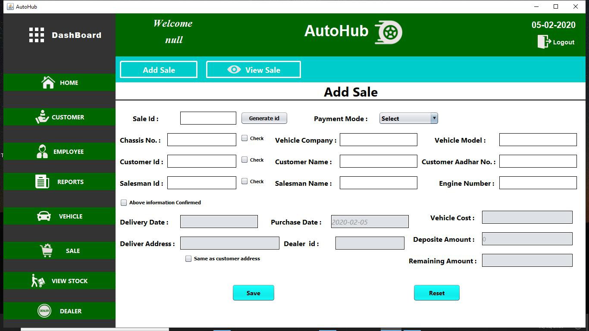

# Vehicle-Showroom-Administration
It is a Java based Desktop Application which is used to manage all the vehicle showroom related activities.All the type of selling and buying activities can be managed by this application. There is no need to do work manually.

## Application Screenshots :-

### 1. Admin Login Window : 

### 2. Home Screen : 

### 3. Home Screen : 

There is a image slideshow on home screen which changes the images of car in every 2 seconds.

### 4. Add Customer :

To add customer details.

### 5. View Customer :

To view customer details.

### 6. Add Employee :

To add employee details.

### 7. Reports :

To generate quatations slip.

### 8. Add Sale :

To add sale details.

### 9. Stock :

To check showroom stock.

